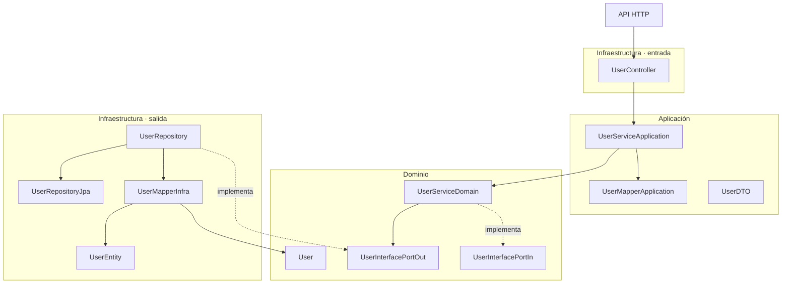

# Plan de mejoras de arquitectura, estructura y flujos reactivos

Estado: **implementado y validado en suite, Template y GR**  
Fecha: **2026-09-23**

## Resultado de ejecución

La implementación se completó de forma aditiva y conserva los extractores Node/Express/JavaScript existentes. El motor ahora genera una vista física exhaustiva y vistas semánticas separadas, reconoce Spring anotado y WebFlux funcional, resume Reactor y mantiene producción y pruebas como source sets distintos.

Validación realizada:

- suite completa: **52/52 pruebas superadas**;
- `template`: **6 endpoints completos** bajo `/user`, todos enlazados con `UserController`, árbol de 23 archivos documentables y Mermaid vertical con mappers, puertos, repositorios e inyecciones;
- `gr`: **106 rutas WebFlux funcionales de producción**, **0 endpoints procedentes de tests**, **947 pipelines Reactor**, **2 pipelines SSE**, **9 llamadas WebClient**, **40 dependencias Gradle**, 1.829 fuentes y 1.951 archivos documentables;
- `WorkOrderRouter`, `AttentionRouter` e `InspectorAdminRouter` quedaron enlazados con sus handlers, incluidos prefijos anidados, predicados y filtros;
- la bóveda candidata grande generó 9.203 archivos antes de que el control de seguridad bloqueara correctamente la publicación por un secreto potencial presente en la salida factual del repositorio real; el control no fue desactivado.

Durante la validación también se corrigieron dos defectos de escala previos: el identificador de runs multirrepositorio podía conservar un carácter nulo y la composición de artefactos expandía más de cien mil hechos como argumentos de una sola llamada.

## 1. Propósito

Este documento plantea la evolución del sistema de documentación para:

- mostrar la estructura real de cada repositorio, incluyendo carpetas y archivos;
- reemplazar diagramas demasiado resumidos por vistas arquitectónicas navegables;
- mejorar la documentación de Spring MVC anotado;
- incorporar Spring WebFlux funcional con `RouterFunction` y handlers;
- representar flujos Reactor con `Mono`, `Flux`, bifurcaciones, concurrencia y errores;
- reconocer arquitecturas limpias, puertos, adaptadores y proyectos Gradle multi-módulo;
- preservar el funcionamiento actual de Node.js, JavaScript, TypeScript y TSX;
- mantener la trazabilidad y evitar presentar inferencias estáticas como ejecución observada.

La implementación debe ser incremental y retrocompatible. Las capacidades Java/WebFlux se añadirán como extensiones, no como reemplazo de los extractores existentes.

## 2. Repositorios de referencia

Se usarán dos repositorios reales como casos de aceptación complementarios.

### 2.1 `template`

Microservicio Java pequeño con arquitectura hexagonal:

- Spring anotado;
- controller;
- servicio de aplicación;
- mapper de aplicación;
- dominio;
- puertos de entrada y salida;
- repositorio y JPA;
- mapper de infraestructura;
- entidades de dominio y persistencia.

El run revisado contiene:

- 17 módulos fuente;
- 58 dependencias entre módulos;
- 87 símbolos;
- 107 llamadas entre símbolos;
- 15 hechos de construcción o inyección;
- siete fragmentos HTTP, aunque solo seis corresponden a endpoints de método.

### 2.2 `gr`

Sistema empresarial Java 21, WebFlux y Gradle multi-módulo:

- alrededor de 1.829 archivos Java;
- 1.247 archivos productivos;
- 582 archivos de pruebas;
- 43 routers funcionales productivos;
- aproximadamente 99 declaraciones de rutas;
- 49 archivos de handlers;
- alrededor de 530 archivos productivos que utilizan `Mono` o `Flux`;
- R2DBC;
- WebClient;
- RabbitMQ;
- Service Bus;
- Server-Sent Events;
- tareas programadas;
- puertos y adaptadores;
- más de 20 archivos de módulos Gradle.

Este repositorio está configurado actualmente como `enabled: false`. Deberá habilitarse solamente cuando se decida ejecutar una validación real.

## 3. Problemas observados

### 3.1 El diagrama arquitectónico descarta información disponible

El renderizador actual agrupa `source_module` por `role` y dibuja únicamente cantidades, por ejemplo:

```text
mapper · 2 módulo(s)
repository · 2 módulo(s)
service · 2 módulo(s)
```

Aunque los hechos contienen nombres y relaciones, el diagrama no consume `module_dependency`, `symbol_call`, implementaciones, bindings ni inyecciones. Por eso componentes como `UserMapperInfra` están extraídos, pero no aparecen en la arquitectura.

### 3.2 Orientación horizontal poco legible

Los diagramas principales usan `flowchart LR`. Cuando existen muchos roles o módulos, crecen horizontalmente y requieren desplazamiento o zoom excesivo.

La orientación predeterminada para arquitectura y flujos debe ser `flowchart TB`.

### 3.3 Spring anotado no enlaza anotación y método

El extractor actual detecta las anotaciones mediante patrones independientes. En `template` esto provoca:

- `@RequestMapping("/user")` como endpoint separado `UNKNOWN /user`;
- rutas `/new` o `/all` sin el prefijo `/user`;
- handler `Desconocido`;
- imposibilidad de iniciar el grafo desde el método del controller;
- flujos casi idénticos basados en imports del archivo.

El resultado correcto debe contener seis endpoints completos:

```text
POST   /user/new
GET    /user/{id}
GET    /user/id/{identification}
GET    /user/all
PUT    /user/{identification}
DELETE /user/{identification}
```

### 3.4 La estructura física no se documenta de forma exhaustiva

Las rutas de los módulos permiten inferir muchas carpetas, pero la documentación no produce un árbol completo y no siempre incorpora recursos, manifiestos, configuración, scripts y archivos de pruebas.

### 3.5 La clasificación depende demasiado del nombre de carpeta

La clasificación actual pierde información como:

- `port/in` frente a `port/out`;
- `main` frente a `test`;
- excepciones;
- aplicación principal;
- módulos Gradle;
- `entry-points` frente a `driven-adapters`;
- variantes de nombres como `infraestructure`.

### 3.6 Las inyecciones incluyen falsos positivos

Parámetros como `String name` o `long identification` pueden registrarse como dependencias. Debe diferenciarse entre:

- dependencia arquitectónica;
- dato o valor;
- argumento de constructor de entidad;
- configuración;
- implementación candidata.

## 4. Resultado documental propuesto

La documentación de cada servicio se dividirá en vistas con propósitos diferentes. No se intentará colocar toda la información en un único Mermaid.

### 4.1 Árbol físico del repositorio

Crear `diagramas/estructura.md` con un árbol textual exhaustivo y legible:

```text
template
├── build.gradle
├── Dockerfile
└── src
    ├── main
    │   ├── java
    │   │   └── com/example/hex_arch
    │   │       ├── TemplateApplication.java
    │   │       ├── application
    │   │       │   ├── dto
    │   │       │   ├── mapper
    │   │       │   └── service
    │   │       ├── domain
    │   │       │   ├── entity
    │   │       │   ├── port
    │   │       │   │   ├── in
    │   │       │   │   └── out
    │   │       │   └── service
    │   │       └── infrastructure
    │   │           ├── controller
    │   │           ├── entity
    │   │           ├── mapper
    │   │           └── repository
    │   └── resources
    └── test
```

Debe incluir, cuando existan:

- código productivo;
- pruebas unitarias;
- pruebas de aceptación;
- recursos;
- configuración;
- manifiestos;
- Dockerfiles;
- módulos de build;
- scripts relevantes.

Dependencias, binarios y carpetas de build deben permanecer excluidos.

### 4.2 Arquitectura semántica vertical

Crear una vista `flowchart TB` agrupada por capas o módulos reales:



Reglas visuales:

- orientación vertical por defecto;
- nombres reales, no solamente cantidades;
- rutas completas fuera de los nodos cuando sean demasiado largas;
- colores discretos por capa o tipo de sistema;
- flecha continua para relaciones respaldadas;
- flecha discontinua para relaciones candidatas o no resueltas;
- leyenda común;
- tests separados de producción;
- división por módulo o capa cuando se supere el límite de legibilidad.

### 4.3 Grafo de módulos de build

Para repositorios multi-módulo se generará una vista independiente:

```text
app-service
├── domain-model
├── domain-usecase
├── entry-points-reactive-web
├── entry-points-rabbit-reactive-mq
├── driven-adapters-r2dbc-postgresql
├── driven-adapters-remote-repository
└── driven-adapters-async-messages-sender
```

Este grafo se obtendrá de Gradle, Maven, npm workspaces u otros manifiestos, no de convenciones de carpetas únicamente.

### 4.4 Flujos por endpoint

Cada endpoint debe mostrar métodos y fronteras arquitectónicas:

```text
Endpoint
→ router o controller
→ handler
→ servicio o caso de uso
→ mapper
→ puerto
→ adaptador
→ repositorio, broker o servicio externo
→ respuesta
```

El Mermaid general mostrará componentes; el flujo individual mostrará métodos y decisiones relevantes.

## 5. Soporte de Spring

### 5.1 Spring anotado

El extractor debe asociar mediante AST:

- anotación de clase;
- prefijo de clase;
- anotación de método;
- verbo HTTP;
- ruta del método;
- método Java inmediatamente asociado;
- clase del controller;
- parámetros y cuerpo;
- tipo de retorno;
- evidencias exactas.

Debe soportar al menos:

- `@RequestMapping`;
- `@GetMapping`;
- `@PostMapping`;
- `@PutMapping`;
- `@PatchMapping`;
- `@DeleteMapping`;
- `value` y `path`;
- arreglos de rutas cuando sean estáticamente resolubles.

### 5.2 WebFlux anotado

Usa las mismas anotaciones, pero debe conservar:

- retorno `Mono<T>`;
- retorno `Flux<T>`;
- `Publisher<T>`;
- cuerpo reactivo;
- tratamiento de vacío y error;
- cardinalidad del payload.

No se debe clasificar una aplicación como WebFlux únicamente por encontrar `Mono` o `Flux`, porque Spring MVC también admite tipos reactivos.

### 5.3 WebFlux funcional

El extractor debe reconocer:

- `RouterFunctions.route(...)`;
- `route()` con builder;
- `GET`, `POST`, `PUT`, `PATCH` y `DELETE`;
- `RouterFunctions.nest(...)`;
- `.path(...)`;
- `.nest(...)`;
- `.andRoute(...)`;
- `.andOther(...)`;
- `.add(...)`;
- `.filter(...)`;
- `.before(...)`;
- `.after(...)`;
- predicados `accept`, `contentType`, headers y query parameters;
- referencias `handler::method`;
- lambdas inline;
- constantes y concatenaciones estáticas de rutas;
- orden de declaración.

Ejemplo de hecho normalizado:

```json
{
  "kind": "http_endpoint",
  "framework": "spring-webflux-functional",
  "method": "GET",
  "path": "/users/{id}",
  "handler_class": "UserHandler",
  "handler_method": "getById",
  "handler_symbol_id": "symbol-...",
  "router_class": "UserRouter",
  "predicates": ["accept(application/json)"],
  "filters": [],
  "reactive": true,
  "status": "supported"
}
```

## 6. Modelo de flujos Reactor

### 6.1 Información mínima

Para cada método reactivo se conservará:

- contenedor: `Mono`, `Flux`, `Publisher` u otro;
- tipo de payload;
- cardinalidad: `0..1`, `0..N` o `completion-only`;
- fuente del publisher;
- transformaciones relevantes;
- ramas por vacío;
- ramas por error;
- operaciones paralelas;
- cambio de scheduler cuando exista;
- destino de datos o integración;
- operación terminal o respuesta.

### 6.2 Operadores prioritarios

Transformación y composición:

- `map`;
- `flatMap`;
- `flatMapMany`;
- `concatMap`;
- `transform`;
- `zip`;
- `zipWith`;
- `then`;
- `thenReturn`;
- `thenMany`;
- `Mono.when`;
- `Flux.merge`;
- `Flux.concat`.

Vacío y error:

- `switchIfEmpty`;
- `defaultIfEmpty`;
- `onErrorResume`;
- `onErrorMap`;
- `doOnError`;
- `retry`;
- `retryWhen`;
- `timeout`.

Concurrencia y ciclo de vida:

- `publishOn`;
- `subscribeOn`;
- `doOnNext`;
- `doFinally`;
- `subscribe`.

No todos los operadores deben convertirse en nodos. El renderizador agrupará operadores triviales y conservará los que cambien dependencia, cardinalidad, concurrencia, vacío, error o resultado.

### 6.3 Entrada y salida HTTP

Extraer:

- `bodyToMono`;
- `bodyToFlux`;
- `pathVariable`;
- `queryParam`;
- principal y headers;
- validación;
- `ServerResponse.ok`;
- `created`;
- `notFound`;
- `badRequest`;
- `status`;
- `body`;
- `bodyValue`;
- content type y headers relevantes.

### 6.4 Server-Sent Events

Debe distinguirse entre el contenedor de la respuesta y el publisher del cuerpo:

```text
handler: Mono<ServerResponse>
content-type: text/event-stream
body: Flux<ServerSentEvent<T>>
comportamiento: stream reactivo de múltiples eventos
```

No se afirmará que un stream es infinito salvo evidencia explícita.

## 7. Arquitectura limpia, Lombok y resolución de dependencias

### 7.1 Lombok

Reconocer al menos:

- `@RequiredArgsConstructor`;
- campos `final`;
- constructor implícito;
- tipo del campo;
- relación de inyección generada.

La ausencia de un constructor escrito no debe impedir enlazar Handler → UseCase o UseCase → Port.

### 7.2 Puertos y adaptadores

Extraer:

- `implements`;
- `extends`;
- interfaz de entrada;
- interfaz de salida;
- implementación concreta;
- adaptadores de persistencia;
- consumidores remotos;
- publishers y listeners.

Ejemplo:

```text
SiaTrasladoPortOut
← implementado por SiaTrasladoConsumer
→ utiliza WebClient
→ llama al sistema SIA
```

### 7.3 Herencia y genéricos

Debe poder seguir adaptadores que hereden operaciones de clases genéricas, por ejemplo:

```java
AdapterOperations<E, D, I, R extends R2dbcRepository<D, I>>
```

Se conservarán tanto la clase base como la implementación concreta y el repositorio especializado.

### 7.4 Mappers generados

MapStruct, Lombok y otros generadores deben documentarse a partir de declaraciones observables. No se inventará código generado ausente del snapshot.

## 8. Persistencia, integraciones y otros entry points

### 8.1 Persistencia reactiva

Reconocer:

- `R2dbcRepository`;
- `ReactiveCrudRepository`;
- `ReactiveQueryByExampleExecutor`;
- `DatabaseClient`;
- `R2dbcEntityTemplate`;
- repositorios propios que devuelven `Mono` o `Flux`;
- entidades y tablas cuando sean observables.

### 8.2 WebClient

Extraer cuando sea posible:

- método HTTP;
- URI o expresión;
- alias/base URL;
- configuración externa usada;
- headers sin revelar secretos;
- body;
- tipo esperado de respuesta;
- `retrieve` o `exchangeToMono`;
- `onStatus`;
- timeout;
- retry;
- tratamiento de errores.

Los valores sensibles no se copiarán a la documentación.

### 8.3 Mensajería y tareas

Los flujos también pueden comenzar en:

- listener de RabbitMQ;
- listener de Service Bus;
- consumidor Kafka;
- scheduler;
- tarea periódica;
- stream SSE;
- evento de aplicación.

Cada tipo tendrá una entrada visual diferente y no se presentará como endpoint HTTP.

## 9. Riesgos reactivos candidatos

Detectar, sin declarar automáticamente un defecto:

- `.block()`;
- `.blockFirst()`;
- `.blockLast()`;
- `.subscribe()`;
- `Thread.sleep`;
- `Future.get`;
- APIs JDBC/JPA bloqueantes alcanzables desde WebFlux;
- efectos no encadenados;
- ausencia visible de tratamiento de vacío o error;
- cambios relevantes de scheduler.

La clasificación dependerá del contexto:

```text
frontera de runtime
listener
tarea programada
suscripción de infraestructura
fire-and-forget dentro de caso de uso
contexto no resuelto
```

Una suscripción en un listener o scheduler no debe marcarse igual que una suscripción interna alcanzada desde un endpoint HTTP.

## 10. Modelo estructural propuesto

Cada archivo documentable debería conservar:

```text
path
kind: directory | source | resource | manifest | test | config | script
source_set: main | test | acceptance
build_module
package
language
layer
architectural_role
port_direction: in | out | none
symbols
evidence
```

Relaciones semánticas propuestas:

```text
declares_route
routes_to_handler
injects_dependency
calls_symbol
implements_port
extends_adapter
reads_request_body
reads_path_variable
reads_query_parameter
transforms_reactive
branches_on_empty
handles_error
executes_parallel
accesses_data
calls_http
publishes_message
consumes_message
streams_sse
builds_response
```

Cuando sea posible, estas relaciones reutilizarán los hechos actuales. Los campos nuevos serán opcionales para preservar la compatibilidad.

## 11. Compatibilidad con Node.js, JavaScript y TypeScript

### 11.1 Principio

Las mejoras Java/WebFlux serán aditivas. No se reemplazarán los extractores existentes de:

- Node.js;
- Express;
- JavaScript;
- TypeScript;
- TSX;
- aplicaciones cliente.

### 11.2 Contratos retrocompatibles

- Los hechos existentes conservarán su significado.
- Los campos reactivos serán opcionales.
- El renderizador aceptará hechos antiguos y enriquecidos.
- Las reglas Java podrán versionarse sin invalidar innecesariamente bundles Node.
- Los cambios compartidos deberán incluir pruebas de regresión.

### 11.3 Beneficios compartidos

Node y JavaScript también recibirán:

- Mermaid vertical;
- árbol de archivos;
- nombres reales de componentes;
- separación entre producción y pruebas;
- vistas por módulo;
- flujos más navegables;
- límites de tamaño para diagramas.

Un flujo Express seguirá representándose como:

```text
ruta
→ middleware
→ controller
→ service
→ repository
→ datos o integración
```

## 12. Límites de legibilidad

Para evitar diagramas inmanejables:

- la arquitectura general mostrará módulos y componentes principales;
- cada módulo tendrá una página detallada;
- cada endpoint o entrada tendrá un flujo separado;
- getters, setters y operadores triviales no aparecerán en el mapa general;
- el árbol textual conservará la estructura exhaustiva;
- las tablas conservarán la trazabilidad completa;
- los nodos y aristas tendrán límites configurables;
- los elementos omitidos por límite se reportarán explícitamente;
- nunca se recortará silenciosamente evidencia.

## 13. Fases de implementación

### Fase 1. Base estructural y regresión

- congelar fixtures y snapshots actuales de Node/Express/TypeScript;
- añadir fixtures de `template`;
- modelar `source_set`, archivo, carpeta y módulo de build;
- generar el árbol del repositorio;
- distinguir producción, pruebas y aceptación;
- añadir pruebas de compatibilidad de contratos.

### Fase 2. Spring anotado

- asociar anotación de clase y método mediante AST;
- componer rutas completas;
- enlazar endpoint con símbolo handler;
- eliminar el falso endpoint de prefijo;
- reconstruir flujos específicos por método.

### Fase 3. Arquitectura semántica

- consumir dependencias entre módulos;
- consumir llamadas soportadas;
- incorporar interfaces, implementaciones y puertos;
- mejorar clasificación de capas y roles;
- excluir falsos positivos de inyección;
- generar Mermaid vertical.

### Fase 4. WebFlux funcional

- extraer builders y routers directos;
- resolver constantes y concatenaciones;
- componer `path` y `nest`;
- conservar predicados y filtros;
- enlazar referencia de método con handler;
- soportar lambdas inline;
- conservar orden de rutas.

### Fase 5. Reactor

- obtener contenedor, payload y cardinalidad;
- resumir pipelines;
- representar vacío, error y concurrencia;
- reconocer entrada y salida WebFlux;
- soportar SSE;
- clasificar riesgos reactivos por contexto.

### Fase 6. Puertos, adaptadores e integraciones

- interpretar Lombok;
- resolver interfaces e implementaciones;
- resolver herencia y genéricos relevantes;
- incorporar R2DBC;
- incorporar WebClient;
- incorporar mensajería y tareas como entry points.

### Fase 7. Navegación y escalabilidad

- crear vista por módulo Gradle;
- crear vista por capa;
- crear vista por router;
- crear flujo por endpoint;
- aplicar límites de legibilidad;
- mejorar índices y enlaces de Obsidian.

### Fase 8. Validación real

- ejecutar suite completa;
- regenerar `template`;
- comparar endpoints y arquitectura esperada;
- habilitar `gr` únicamente para el run de validación autorizado;
- revisar una muestra representativa de routers y handlers;
- medir tiempo, memoria y tamaño de salida;
- inspeccionar visualmente Mermaid en Obsidian;
- verificar que Node/JavaScript no presente regresiones.

## 14. Estrategia de pruebas

### 14.1 Regresión existente

Mantener y ampliar pruebas para:

- Express;
- imports JS/TS;
- controllers y servicios TypeScript;
- clientes HTTP;
- aplicaciones React/TSX;
- publicación acumulativa;
- actualización incremental;
- MCP.

### 14.2 Fixtures Spring

- prefijo de clase;
- cada verbo HTTP;
- múltiples rutas;
- `value` y `path`;
- endpoint anotado que retorna valor normal;
- endpoint anotado que retorna `Mono`;
- endpoint anotado que retorna `Flux`.

### 14.3 Fixtures WebFlux funcional

- router simple;
- builder con varias rutas;
- `RouterFunctions.route(predicate, handler)`;
- `path`;
- `nest`;
- constantes;
- concatenaciones;
- referencia de método;
- lambda inline;
- filtros;
- predicados de content type y accept;
- ruta dinámica no resoluble;
- aplicación híbrida con anotaciones y routers funcionales.

### 14.4 Fixtures Reactor

- `map` y `flatMap`;
- `zip` y `zipWith`;
- `Mono.when`;
- `switchIfEmpty`;
- `onErrorResume`;
- timeout y retry;
- `Mono<Void>`;
- `Flux<T>`;
- SSE;
- WebClient;
- R2DBC;
- suscripción legítima de listener;
- suscripción candidata dentro de caso de uso.

## 15. Criterios de aceptación para `template`

- existe un árbol completo del repositorio;
- `application.properties`, Gradle, Dockerfile y pruebas aparecen en la estructura;
- el diagrama usa `flowchart TB`;
- `UserMapperInfra` y `UserMapperApplication` aparecen separadamente;
- se distinguen aplicación, dominio e infraestructura;
- se distinguen puertos de entrada y salida;
- se muestran implementaciones de interfaces;
- existen seis endpoints completos bajo `/user`;
- ningún endpoint tiene handler `Desconocido`;
- `POST /user/new` alcanza mappers, dominio, repositorio y JPA;
- los diagramas de endpoint no son copias del cierre de imports.

## 16. Criterios de aceptación para `gr`

- se genera el grafo de módulos Gradle;
- se distinguen `applications`, `domain`, `entry-points`, `driven-adapters`, `helpers` y `test`;
- se reconocen las variantes reales de `RouterFunction`;
- se resuelven rutas literales, constantes y prefijos anidados;
- cada ruta queda enlazada a su método handler;
- Lombok no impide enlazar handlers con casos de uso;
- se reconocen puertos e implementaciones concretas;
- se documentan R2DBC y WebClient;
- el flujo de orden de trabajo alcanza el consumidor SIA;
- `Mono.when`, `zipWith`, `thenReturn` y `onErrorResume` se representan sin ruido excesivo;
- el endpoint SSE muestra `text/event-stream` y el `Flux<ServerSentEvent<T>>` del cuerpo;
- Swagger enriquece, pero no condiciona, el descubrimiento;
- pruebas y código productivo se separan;
- `subscribe()` se clasifica según su contexto;
- ningún diagrama general intenta contener cientos de clases en una sola vista.

## 17. Criterios de no regresión para Node y JavaScript

- todos los tests actuales continúan pasando;
- los endpoints Express conservan método, ruta y handler;
- las llamadas HTTP salientes conservan correlación y estado;
- las páginas de clases y métodos continúan generándose;
- las aplicaciones TSX conservan pantallas y flujos;
- las actualizaciones incrementales continúan reutilizando hechos intactos;
- los bundles anteriores siguen siendo renderizables;
- los campos Java/WebFlux no son obligatorios para hechos Node;
- la publicación y las herramientas MCP mantienen compatibilidad.

## 18. Decisiones de implementación

1. El AST es la fuente principal para enlazar símbolos y estructuras.
2. Swagger/OpenAPI es enriquecimiento opcional.
3. Los manifiestos de build definen módulos cuando estén disponibles.
4. Las convenciones de carpetas son señales, no verdad única.
5. El código estático no demuestra ejecución en producción.
6. Toda inferencia conserva estado `supported`, `candidate` o `unresolved`.
7. Los riesgos reactivos se reportan como candidatos contextualizados.
8. El árbol físico y la arquitectura semántica son vistas diferentes.
9. La documentación exhaustiva vive en árboles, tablas y páginas navegables; no en un Mermaid único.
10. La compatibilidad con Node/JavaScript es un criterio obligatorio de cada fase.

## 19. Fuera de alcance inicial

- ejecutar las aplicaciones analizadas;
- observar tráfico real;
- afirmar rendimiento o ausencia de bloqueos en producción;
- ejecutar consultas contra bases de datos externas;
- resolver expresiones de rutas completamente dinámicas;
- reconstruir código generado que no exista en el snapshot;
- sustituir revisión humana de riesgos reactivos;
- modificar repositorios de aplicaciones.

## 20. Entregables esperados

- contratos ampliados y retrocompatibles;
- extractores Spring y WebFlux basados en AST;
- resolución de módulos Gradle;
- clasificación estructural enriquecida;
- modelo resumido de pipelines Reactor;
- renderizador Mermaid vertical;
- árbol físico por repositorio;
- páginas por módulo, router y endpoint;
- pruebas sintéticas y de regresión;
- validación real contra `template` y `gr`;
- actualización de progreso, pendientes y guía de funcionamiento.

---

Este plan debe ejecutarse por fases verificables. No se considerará completada una fase solo porque compile: deberá demostrar la mejora en los documentos generados y conservar el comportamiento previamente comprobado.
