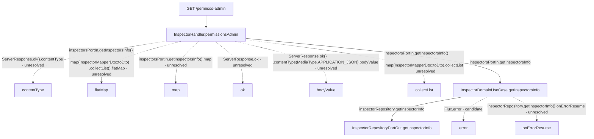

# Entrada GET /permisos-admin

Servicio: **gr**  
Handler observado: `InspectorHandler.permissionsAdmin`  
Estado: **ruta completa**  
Archivo de origen: `infraestructure/entry-points/reactive-web/src/main/java/sura/csmovilidad/web/admin/permission/service/InspectorRouter.java`

> El flujo usa llamadas entre símbolos extraídas del AST. No representa telemetría; una llamada candidata o no resuelta se conserva como limitación explícita.

## Diagrama del flujo



## Clases y métodos del flujo

| Paso | Clase | Método o función | Responsabilidad derivada | Evidencia de origen |
|---:|---|---|---|---|
| 1 | InspectorHandler | permissionsAdmin | Ejecuta la operación asociada a «permissions admin»; invoca flatMap, collectList, map, getInspectorsInfo, bodyValue, contentType, ok. Descripción derivada del código estático. | infraestructure/entry-points/reactive-web/src/main/java/sura/csmovilidad/web/admin/permission/service/InspectorHandler.java:17 |
| 2 | InspectorDomainUseCase | getInspectorsInfo | Obtiene o consulta asociada a «get inspectors info»; invoca onErrorResume, getInspectorInfo, error. Descripción derivada del código estático. | domain/usecase/src/main/java/sura/csmovilidad/usecase/admin/permission/InspectorDomainUseCase.java:19 |
| 3 | InspectorRepositoryPortOut | getInspectorInfo | Obtiene o consulta asociada a «get inspector info». Descripción derivada del código estático. | domain/model/src/main/java/sura/csmovilidad/domain/admin/permission/port/outport/InspectorRepositoryPortOut.java:8 |

## Datos utilizados

| Operación | Entidad o recurso | Archivo | Evidencia |
|---|---|---|---|
| No detectado | No detectado | No detectado | No disponible |

## Integraciones salientes

| Método | Destino | Archivo |
|---|---|---|
| No detectada | No detectada | No detectada |

## Fragmentos observados

### InspectorHandler.permissionsAdmin

`infraestructure/entry-points/reactive-web/src/main/java/sura/csmovilidad/web/admin/permission/service/InspectorHandler.java:17`

```java
@SuppressWarnings("unused")
    public Mono<ServerResponse> permissionsAdmin(ServerRequest request){
        return inspectorsPortIn.getInspectorsInfo()
                .map(InspectorMapperDto::toDto)
                .collectList()
                .flatMap(inspectorDto ->
                        ServerResponse.ok()
                                .contentType(MediaType.APPLICATION_JSON)
                                .bodyValue(inspectorDto));
    }
```

### InspectorDomainUseCase.getInspectorsInfo

`domain/usecase/src/main/java/sura/csmovilidad/usecase/admin/permission/InspectorDomainUseCase.java:19`

```java
@Override
    public Flux<InspectorT> getInspectorsInfo() {
        return inspectorRepository.getInspectorInfo()
                .onErrorResume(ex ->
                        Flux.error(new ExceptionUseCase(InspectorErrorMessages.GET_INSPECTORS_LIST))
                );
    }
```

### InspectorRepositoryPortOut.getInspectorInfo

`domain/model/src/main/java/sura/csmovilidad/domain/admin/permission/port/outport/InspectorRepositoryPortOut.java:8`

```java
Flux<InspectorT>getInspectorInfo();
```

## Limitaciones

- 8 llamada(s) del flujo conservan resolución candidata o no resuelta.

## Evidencia del endpoint

evidence-c8750e82f814180a8893f1c7

[[../servicio|Volver al servicio]]
